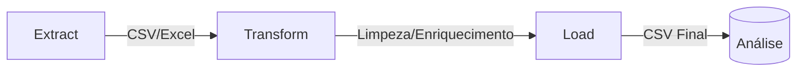

```markdown
# 📊 Pipeline ETL - Desafio Reals Bet

Pipeline de processamento de dados financeiros para análise de agências, clientes e transações.

## 📌 Visão Geral


## 🛠️ Tecnologias
- **Python 3.10.11**
- Bibliotecas Essenciais:
  - `pandas` - Manipulação avançada de DataFrames
  - `pickle` - Serialização de objetos Python
  - `pathlib` - Gestão de caminhos multiplataforma
  - `re` - Expressões regulares para limpeza de dados

- Controle e Segurança:
  - `typing` - Type hints (Dict, Final)
  - `MappingProxyType` - Criação de dicionários imutáveis
  - `os` - Interação com sistema operacional
  - `sys` - Controle do ambiente Python

- Processamento Paralelo:
  - `subprocess` - Execução de scripts externos

- Manipulação de Tempo:
  - `datetime` - Tratamento de datas e horários

## 🚀 Como Executar
1. Clone o repositório:
   ```bash
   git clone https://github.com/seu-usuario/desafio_reals_bet.git
   ```
2. Instale as dependências:
   ```bash
   pip install -r requirements.txt
   ```
3. Execute o pipeline completo:
   ```bash
   python src/main.py
   ```

## 🗂️ Estrutura de Arquivos
```
desafio_reals_bet/
├── src/
│   ├── main.py          # Orquestração
│   ├── extract.py       # Extração de dados
│   ├── transform.py     # Transformação
│   ├── load.py          # Carga final
│   └── utils/           # Funções auxiliares
├── data/
│   ├── raw/             # Dados brutos
│   └── processed/       # Dados tratados
├── tests/               # Testes unitários
└── docs/                # Documentação adicional
```

## 🔧 Configuração
Crie um arquivo `.env` na raiz (opcional):
```ini
DATA_PATH=./data
LOG_LEVEL=INFO
```

## ⚙️ Fluxo Detalhado
### 1. Extração
- Fontes:
  - `agencias.csv`
  - `clientes.xlsx`
  - `colaborador_agencia.csv`
  - `colaboradores.csv`
  - `contas.csv`
  - `propostas_credito.csv`
  - `transacoes.csv`
- Saída:
  - `desafio_reals_bet/src/dados_extraidos.pkl`

### 2. Transformação
- Processos:
  - Padronização de UFs
  - Cálculo de idades
  - Enriquecimento de transações
- Saída:
  - `src/dados_transformados/*.pkl`

### 3. Carga
- Gera CSVs prontos para análise:
  - `agencias_tratado.csv`
  - `clientes_tratado.csv`
  - `colaborador_agencia_tratado.csv`
  - `colaboradores_tratado.csv`
  - `contas_tratado.csv`
  - `propostas_credito_tratado.csv`
  - `transacoes_tratado.csv`

## 🛡️ Controles de Qualidade
- Verificação de tipos de dados
- Proteção contra loops infinitos
- Validação de arquivos de entrada

## 📈 Exemplo de Saída
```python
print(df_clientes.head())
```
| id  | nome          | uf  | idade |
|-----|---------------|-----|-------|
| 1   | João Silva    | SP  | 32    |
| 2   | Maria Santos  | RJ  | 28    |

## ⁉️ Solução de Problemas
| Erro                 | Causa Provável               | Solução                     |
|----------------------|-----------------------------|----------------------------|
| `FileNotFoundError`  | Caminho incorreto           | Verifique `DATA_DIR`       |
| `KeyError`           | Coluna faltante             | Checar arquivos originais  |

## 🤝 Contribuição
1. Faça um fork
2. Crie sua branch (`git checkout -b feature/nova-func`)
3. Commit (`git commit -m 'Add feature'`)
4. Push (`git push origin feature/nova-func`)
5. Abra um PR

## 📄 Licença
MIT © Guilherme Cavalcanti
```